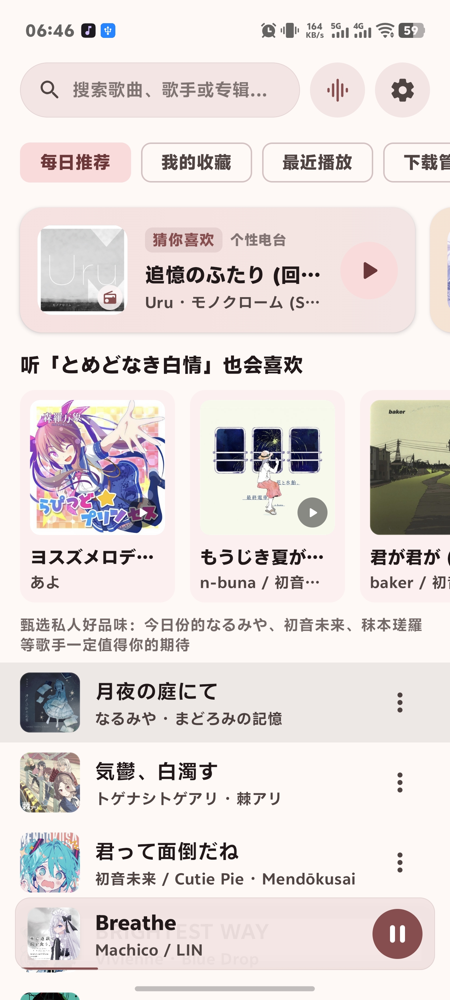
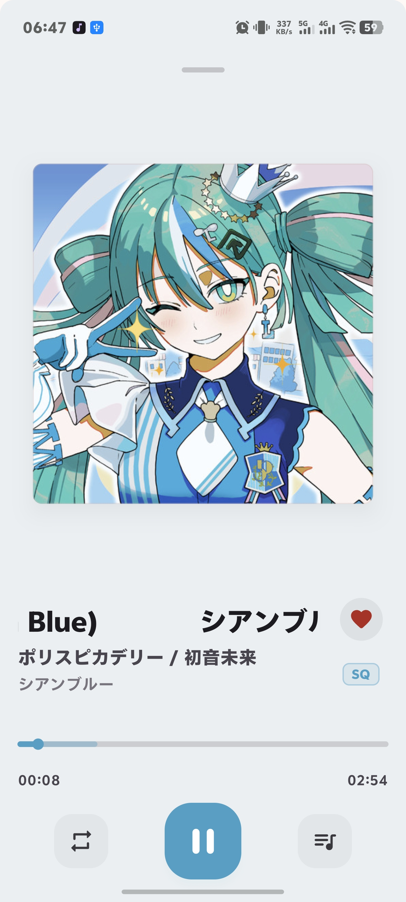

# Melodist TV

简单的第三方QQ音乐播放器

- 支持 arm64 和 x86_64 的 Android 9.0+ 和 Android TV 9.0+
- originOS 版本为伪装 qq 音乐包名以支持 originOS 系统原子控制中心版本
- 没有可靠性支持

## 屏幕截图

| 主页 | 播放界面 |
| :---: | :---: |
|  |  |

## 免责声明

1. 本项目仅供个人学习研究、Android TV 大屏交互体验探索使用，严禁用于任何商业目的或非法牟利。
2. 本应用自身不提供、不存储任何音视频媒体资源。在线播放与检索服务均通过公开网络接口、用户自建 WebDAV 或本地存储提供，相关媒体资源的知识产权归原作者或版权方所有。
3. 用户使用本软件所产生的版权争议由使用者自行承担，开发者不对因使用本软件造成的任何直接或间接后果承担法律责任。

## 开源协议

本项目基于 [MIT License](LICENSE) 许可协议开源。
