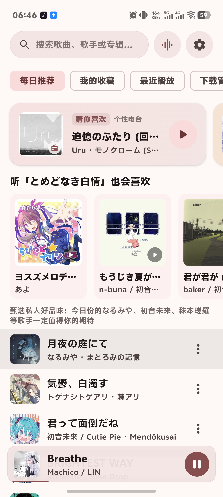
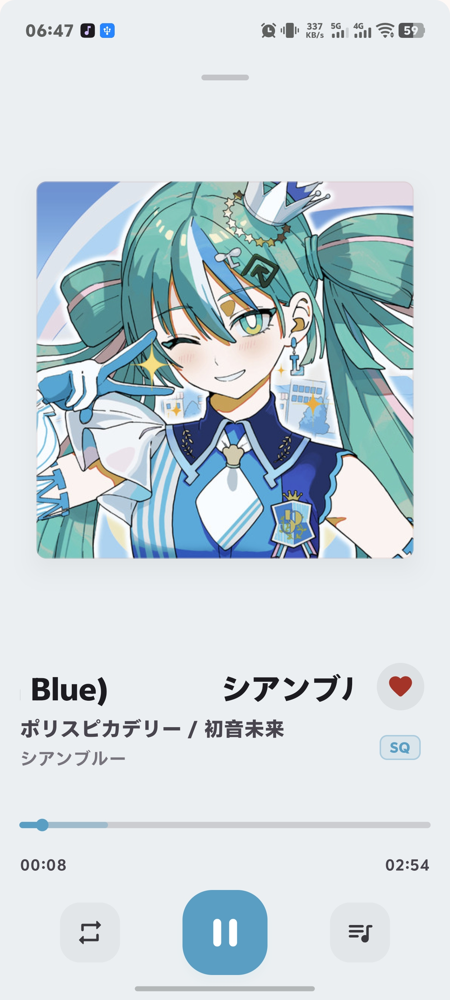

# Melodist

简单的音乐播放器

- 支持 Android 8.0+ 与 Android TV 8.0+ (API 26+)
  - 标准版：支持 `arm64-v8a`
  - OriginOS：支持 `arm64-v8a`（通过伪装包名支持 OriginOS 与 ColorOS 媒体控制中心）
  - Android TV：支持 `arm64-v8a`、`armeabi-v7a`
- 杜比需要手机或TV支持对应的解码器才会显示。DTS仅在TV可用

## 屏幕截图

| 主页 | 播放界面 |
| :---: | :---: |
|  |  |

## 免责声明

1. 本项目仅供个人学习研究、Android TV 大屏交互体验探索使用，严禁用于任何商业目的或非法牟利。
2. 本应用自身不提供、不存储任何音视频媒体资源。在线播放与检索服务均通过公开网络接口、用户自建 WebDAV 或本地存储提供，相关媒体资源的知识产权归原作者或版权方所有。
3. 用户使用本软件所产生的版权争议由使用者自行承担，开发者不对因使用本软件造成的任何直接或间接后果承担法律责任。

## 开源协议

本项目基于 [MIT License](LICENSE) 许可协议开源。
